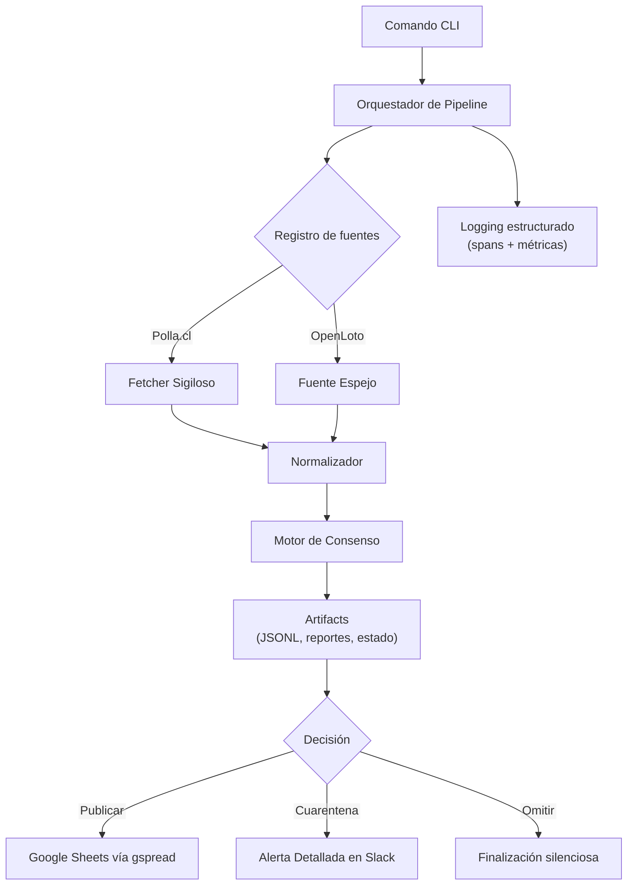

# Polla App — Ingesta confiable de pozos para el Loto de Chile

Agrega estimaciones del próximo pozo integrando la fuente oficial de `polla.cl` con espejos comunitarios verificados, garantiza la procedencia mediante consenso y publica actualizaciones en Google Sheets.

[](https://github.com/cortega26/polla/actions/workflows/tests.yml) [](https://github.com/cortega26/polla/actions/workflows/docs.yml) [](https://github.com/cortega26/polla/actions/workflows/health.yml) [](https://www.python.org/downloads/release/python-3100/) [](license.md) [](https://github.com/cortega26/polla/commits/main)

## Características

- Orquestación de ingesta multi-fuente con un registro unificado (`pozos`, `openloto`, `polla`) y mecanismos de respaldo deterministas.
- Garantía de integridad de datos mediante verificación de hash SHA-256 y cuarentena por consenso basada en magnitud (umbral del 10%).
- Sistema de **Puntaje de Confianza** (`full`, `degraded`, `single_source`) para señalar la fiabilidad de los datos.
- Envío de **Notificaciones Enriquecidas en Slack** para ejecuciones exitosas y **Alertas de Cuarentena** detalladas ante discrepancias.
- Generación de salidas estructuradas en JSONL y reportes de comparación con trazabilidad completa de procedencia.
- CLI basado en Click (`run`, `publish`, `pozos`, `health`) con previsualización de cambios (dry-run) y salvaguardas automatizadas.
- Manejo elegante de límites de tasa (rate-limiting) con retroceso exponencial (jittered backoff) y respeto a robots.txt.
- Comportamiento asegurado con suites de pytest basadas en fixtures y cumplimiento automático de cobertura (umbral del 80%).
- Experiencia de desarrollo (DX) simplificada con objetivos Make, automatización con Black/Ruff/Mypy y paridad con GitHub Actions.

## Stack Tecnológico

- Python 3.11+, Click CLI, Requests + parsers BeautifulSoup
- Integración con Google Sheets vía `gspread` + `google-auth`
- Pruebas: Pytest (+ doctests), fixtures de Faker
- Herramientas: Ruff, Black, Mypy, GitHub Actions (tests, docs, health)

## Arquitectura de un Vistazo



## Inicio Rápido

1. **Valida tu entorno**: Ejecuta la verificación automática para asegurar que todo esté configurado correctamente:

   ```bash
   make ready
   ```

2. **Ejecuta el pipeline de pozos localmente**:

   ```bash
   python -m polla_app run --sources pozos
   ```

3. **Simulacro de publicación** (requiere credenciales):

   ```bash
   python -m polla_app publish --dry-run
   ```

### Configuración

| Nombre                               | Tipo        | Por defecto     | Requerido      | Descripción                                                           |
| :----------------------------------- | :---------- | :-------------- | :------------- | :-------------------------------------------------------------------- |
| `GOOGLE_SPREADSHEET_ID`              | string      | —               | Para `publish` | ID de la hoja de cálculo de Google para la publicación.               |
| `GOOGLE_SERVICE_ACCOUNT_JSON`        | string JSON | —               | Condicional    | Credenciales de cuenta de servicio en línea (alternativa a archivo).  |
| `GOOGLE_CREDENTIALS` / `CREDENTIALS` | string JSON | —               | Condicional    | Variables de entorno legacy para autenticación de cuenta de servicio. |
| `service_account.json`               | archivo     | —               | Condicional    | Credenciales en disco si no se proporcionan variables de entorno.     |
| `ALT_SOURCE_URLS`                    | string JSON | `{}`            | No             | Sobrescribe las URLs de las fuentes para espejos o pruebas.           |
| `POLLA_USER_AGENT`                   | string      | Library default | No             | User-agent HTTP personalizado para scraping respetuoso.               |
| `POLLA_RATE_LIMIT_RPS`               | float       | sin definir     | No             | Límite de peticiones por segundo por host.                            |
| `POLLA_MAX_RETRIES`                  | entero      | `3`             | No             | Máximo de intentos de reintento por petición.                         |
| `POLLA_BACKOFF_FACTOR`               | float       | `0.3`           | No             | Multiplicador para el retraso del retroceso exponencial.              |
| `POLLA_429_BACKOFF_SECONDS`          | entero      | —               | No             | Retraso fijo tras recibir un código de estado 429 (fallback).         |
| `SLACK_WEBHOOK_URL`                  | string      | —               | No             | Destino para resúmenes de ejecución y alertas de discrepancia.        |

## Calidad y Pruebas

- `pytest -q` – ejecuta las suites de unidad e integración con fixtures offline; espera `N passed` en menos de 10s.
- `ruff check polla_app tests` – impone reglas de linting, nomenclatura e higiene de importaciones.
- `mypy polla_app` – verifica el tipado estricto (se ignoran stubs de terceros no disponibles).
- `black --check polla_app tests` – mantiene un formato consistente.
- `pytest --doctest-glob='*.md' README.md docs -q` – asegura que los ejemplos de la documentación sigan siendo ejecutables.

CI refleja estos comandos a través de `.github/workflows/tests.yml` y `.github/workflows/docs.yml` para que las ejecuciones locales coincidan con la automatización. Añade `pytest --cov=polla_app` cuando necesites un reporte de cobertura.[^coverage]

## Rendimiento y Confiabilidad

- **Parsing de Alto Rendimiento**: `scripts/benchmark_pozos_parsing.py` asegura que mantengamos un tiempo medio de scraping inferior a **150ms**.
- **Observabilidad**: Métricas y tramas (spans) estructuradas brindan visibilidad profunda sobre el proceso de toma de decisiones de consenso.
- **Confiabilidad**: El flujo programado `health.yml` ejercita el pipeline diariamente para detectar derivas en las fuentes antes de que impacten la producción.

## Hoja de Ruta

- Agregar fixtures de prueba de humo para nuevos espejos agregadores emergentes.
- Implementar parsing de niveles de premios más granulares para la fuente de Polla.

## Por Qué es Importante

- Demuestra empatía operativa: valores por defecto de dry-run, soporte para cuarentena y procedencia explícita reducen el estrés de guardia (on-call).
- Destaca prácticas disciplinadas de scraping respetuosas de la infraestructura de terceros y los límites legales.
- Muestra capacidad para automatizar verificaciones de confiabilidad de extremo a extremo (workflow de salud, ganchos de observabilidad, métricas estructuradas).
- Ilustra el enfoque en la experiencia del desarrollador mediante CLI reproducible, objetivos Make y puertas estrictas de tipado y linting.
- Prueba comodidad con el manejo seguro de credenciales al integrar con APIs de Google Workspace.

## Contribución y Licencia

Las contribuciones son bienvenidas—consulta [CONTRIBUTING.md](CONTRIBUTING.md) para conocer las expectativas de estilo, pruebas y revisión.

Este proyecto se distribuye bajo la [Licencia MIT](license.md).
